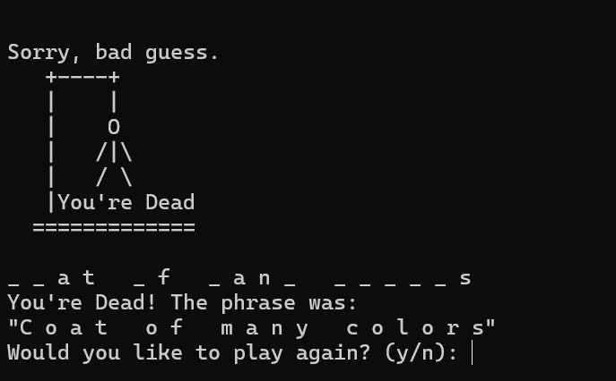
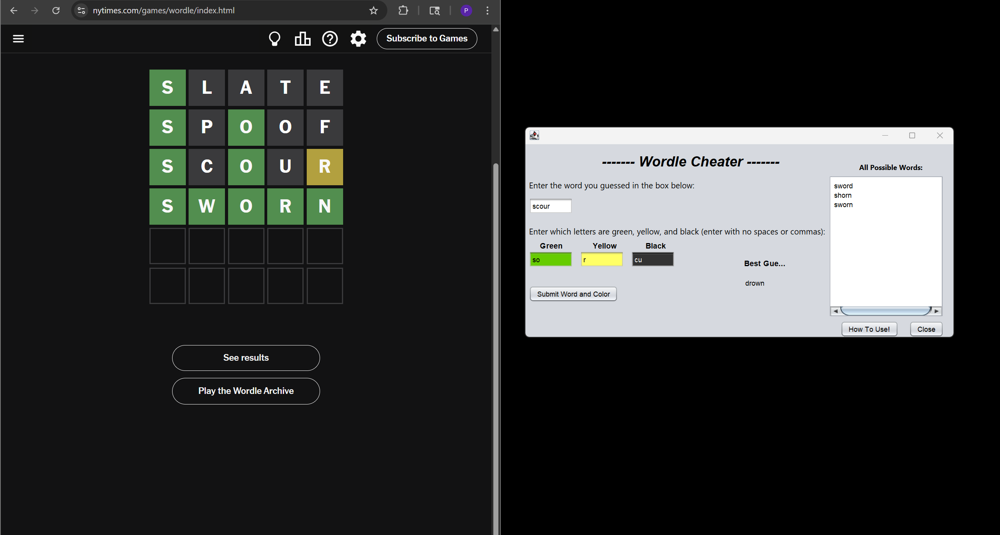

Portfolio
=========

Programming Projects
--------------------

*For access to my private project repositories, please [email me](mailto:ppotisom@student.csuniv.edu?subject=GitHub%20Access) with the subject line, GitHub Access.

---
### [Project 1 Hangman | CSCI 235](project1)

---
### [Project 2 Wordle Cheater | CSCI 325](project2)

---
### [Project 3 Ethernet Cables + Building LAN project | CSCI 332](project3)

---
### [Project 4 Run for bright futures | CSCI 334](project4)

---

Ethics Papers
-------------

### [Paper 1: Hacking: Right or Wrong? A Christian Perspective](/pdf/paper1.pdf)

-   **Class: CSCI 235 Procedural Progamming**  
-   **Grade: 91/100**

### [Paper 2:The Ethical Implications of AI on Your Career Field](/pdf/paper2.pdf)

-   **Class: CSCI 301 Survey of Scripting Languages** 
-   **Grade: 93/100**

### [Paper 3: Ethics in Responding to Cyber Threats](/pdf/paper3.pdf)

-   **Class: CSCI 325 Object Oriented Programming** 
-   **Grade: 95/100**

---

Presentations
-------------

### [Presentation 1: Understanding PII](/pdf/Presentation1.pdf)

- **Class: CSCI 352 Cyber Defense** 
- **Grade: 98/100**

### [Presentation 2: Run for bright futures](/pdf/Presentation2.pdf)

- **Class: CSCI 334 User-Interface Programming** 
- **Grade: 95/100**

### [Presentation 3: Identity Theft - Methods, Impact, and Prevention](/pdf/Presentation3.pdf)

- **Class: CSCI/CRIM 405 Principles of Cybersecurity** 
- **Grade: 90/100**

---

Page template forked from <a href="https://github.com/csu-cs/csci-portfolio">CSU-CS</a>

<!-- Remove above link if you don't want to attributive -->
