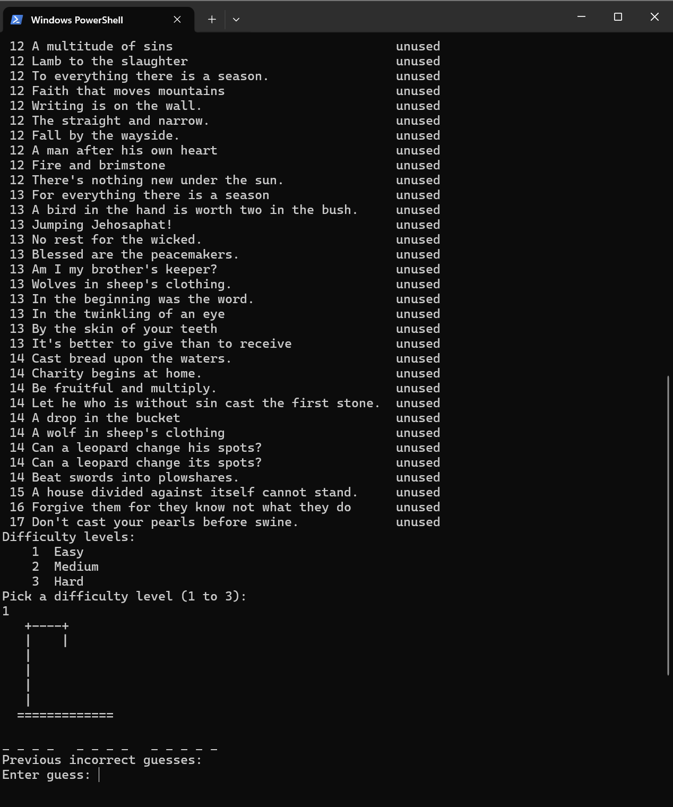
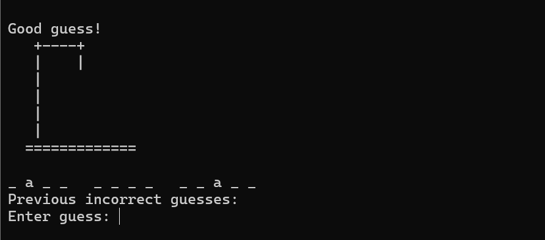
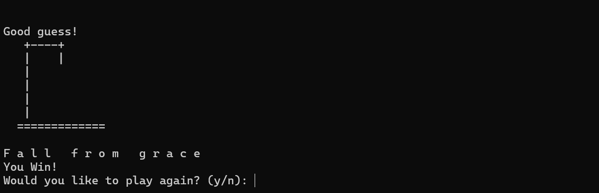

[Back to Portfolio](./)

Project 1 Hang man 
===============

-   **Class: CSCI-235 Procedural Programming** 
-   **Grade: 98/100** 
-   **Language(s): C++** 
-   **Source Code Repository: Available upon request**
    (Please [email me](mailto:ppotisom@student.csuniv.edu?subject=GitHub%20Access) to request access.)

## Project Description

This project is a fun and interactive version of the classic game Hangman, built using C++. The goal of the game is simple: guess the hidden phrase one letter at a time before the hangman drawing is completed.

At the start of the game, the program randomly selects a phrase from a file. The phrase is hidden using underscores, and the player must guess letters to reveal it. Every correct guess shows more of the phrase. Every wrong guess adds another part to the hangman drawing.

The game includes multiple difficulty levels:

Easy → shorter phrases with fewer unique letters

Medium → balanced difficulty

Hard → longer and more complex phrases

This makes the game more interesting and gives the player a real challenge.

Behind the scenes, the program uses structured logic and multiple functions to manage the game. It handles user input, checks guesses, updates the display, and keeps track of progress.

## How to compile and run the program
**Using Visual Studio (Windows)**
```bash
cl Hangman.cpp
.\Hangman.exe
```

If the programming language does not require compilation, the update the heading to be “How to run the program.” If your application is deployed on a remote service, including instructions on how to deploy it.

## UI Design

This is a command-line interface (CLI) application that interacts with the user through text prompts.

User Tasks:
- Select a difficulty level (Easy, Medium, Hard)
- Input letter guesses one at a time
- View progress of the phrase as letters are revealed
- Track incorrect guesses
- Choose whether to replay the game
  
System Behavior:
- Displays the hidden phrase using underscores
- Reveals letters when guessed correctly
- Keeps track of incorrect guesses
- Shows a list of previously guessed wrong letters
- Draws the hangman step-by-step using ASCII art
  
Game Rules:
- You can only guess one letter at a time
- Repeating a guess will give a warning
- Invalid input (like numbers or symbols) is not accepted
- You lose after too many incorrect guesses
- You win when the full phrase is revealed

  
**Fig 1. Starting screen with phrase list and difficulty selection**

  
**Fig 2. Gameplay showing guesses and hangman drawing**

  
**Fig 3. Winning screen after completing the phrase**

## 3. Additional Considerations

Code Structure
- Uses a custom struct to store phrase data
- Breaks the program into multiple functions for clarity

File Handling
- Reads phrases from an external file (phrases.txt)
- Allows easy updates by adding more phrases

Logic and Algorithms
- Sorts phrases by difficulty using selection sort
- Tracks unique letters to measure difficulty
- Uses loops and conditionals to control game flow

Input Validation
- Prevents invalid characters from being used
- Avoids repeated guesses
- Keeps the game stable and user-friendly 

[Back to Portfolio](./)
