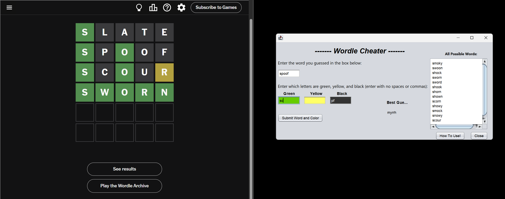
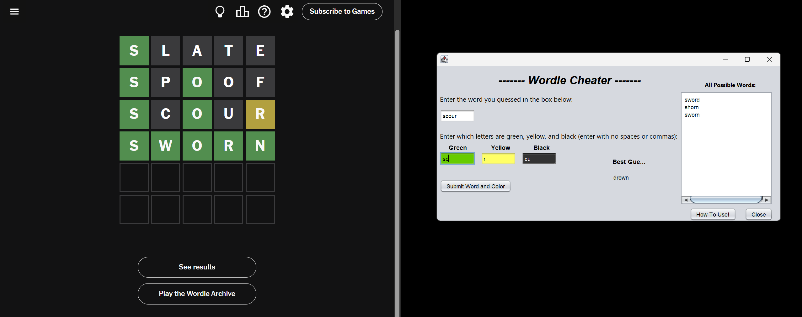

[Back to Portfolio](./)

Project 2 Wordle Cheater
===============

-   **Class: CSCI 325 Object-Oriented Programming** 
-   **Grade: 97/100** 
-   **Language(s): Java using NetBeans GUI** 
-   **Source Code Repository: Available upon request**
    (Please [email me](mailto:ppotisom@student.csuniv.edu?subject=GitHub%20Access) to request access.)

## Project description

This project is a Wordle helper tool that I built using Java and object oriented programming. I used NetBeans to design a simple graphical user interface.

The program helps the user find the best word to guess next in Wordle. The user enters the word they guessed and then types which letters are green, yellow, or black.

The program reads words from a file and applies filtering logic to remove invalid options based on Wordle rules. It removes words that do not match the input and keeps only the possible answers. It also suggests a best next guess to help solve the puzzle faster.

I used classes and methods to organize the code and keep it clean. Each part of the program has a clear role, such as handling input, processing words, and updating the display.

This project helped me understand object oriented design, GUI development, and how to manage data using Java.

## Key Features
- Filters possible words based on Wordle rules
- Suggests best next guess
- GUI built with Java Swing
- Reads word list from file
- Fast and simple user input system
  
## How to compile and run the program

- Open the project in NetBeans.
- Make sure all files are in the same project folder.
- Click the Run button at the top.
- The program will open a window where you can start using the Wordle helper.

## UI Design

This program uses a graphical interface built in NetBeans.
The user types a guessed word into the input box.
There are three input fields for letter feedback.

**Green** means the letter is correct and in the right place.

**Yellow** means the letter is correct but in the wrong place.

**Black** means the letter is not in the word.

After clicking the submit button, the program updates the list of possible words.
It also shows the best next guess based on the remaining words.
The user can repeat this process until the correct word is found.

  
**Fig 1. The launch screen**

  
**Fig 2. Example output after input is processed.**

  
**Fig 3. Feedback when an error occurs.**

## 3. Additional Considerations

This program runs locally and does not need internet access. All words are stored in a text file inside the project.

One challenge was designing filtering logic that correctly handles different Wordle cases, such as repeated letters and position matching for different cases. Another challenge was organizing the code using object oriented principles.

In the future, I could improve this project by adding colors like the real Wordle game and improving the design of the interface. 

This project demonstrates my ability to build a full desktop application using object oriented design and user interface development.

[Back to Portfolio](./)
