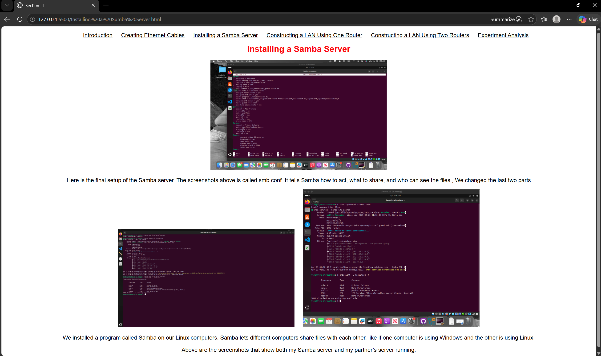
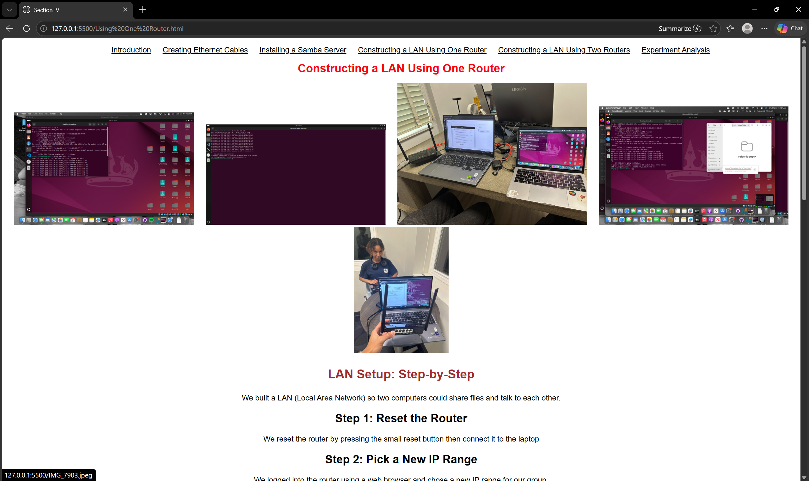
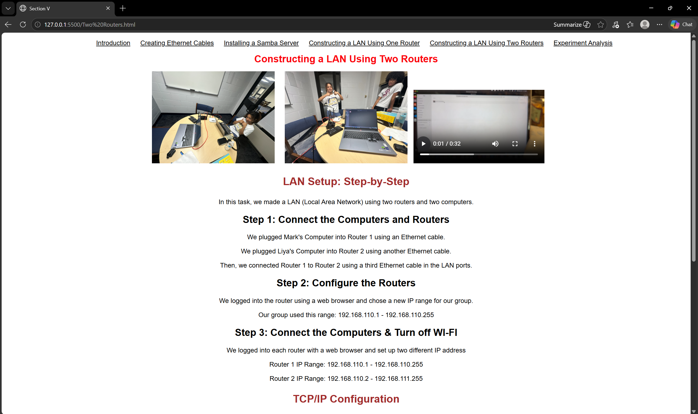

[Back to Portfolio](./)

Project 3 Ethernet Cables + Building LAN project
=================================================

-   **Class: CSCI 332 Applied Networking** 
-   **Grade: 100/100** 
-   **Language(s): HTML, Basic Linux (Bash), Networking (TCP/IP, Samba)** 
-   **Source Code Repository: Available upon request**
    (Please [email me](mailto:ppotisom@student.csuniv.edu?subject=GitHub%20Access) to request access.)

## Project description

This project is a networking lab website that shows how to build and test a small network step by step. It includes creating Ethernet cables, setting up a Samba server, and building LAN connections using one router and two routers.

The website explains each part in a simple way and includes real screenshots from our work. We created Ethernet cables by hand, tested them using a cable tester, and used them to connect computers.

We also installed and configured a Samba server on Linux so different computers could share files. After that, we built LAN networks and configured IP addresses to allow communication between devices.

This project helped me understand how real networks work, including cabling, routing, and file sharing between systems.

## How to compile and run the program

- Open the project folder in the Visual Studio Code
- Open any HTML file (such as index.html) in a web browser
- Use the navigation links at the top to move between sections
- View each step of the networking process with explanations and images

No compilation is required because this project uses HTML.

## UI Design

The website is designed to be simple and easy to follow.

- A navigation bar at the top lets users move between sections
- Each page focuses on one task (cables, server, LAN setup)
- Images show real steps from the lab
- Text explains each step clearly in order
- Users can follow along like a guide

The goal of the design is to make learning networking steps easy and organized.

  
**Fig 1. Samba server configuration and verification using Linux terminal commands.**

  
**Fig 2. LAN setup with one router showing device connections and testing.**

  
**Fig 3. LAN configuration using two routers demonstrating IP range setup and connectivity.**

## 3. Additional Considerations

This project runs locally in a browser and does not need internet access. All content is stored in HTML files and images.

One challenge was making sure each step was explained clearly and matched the actual setup process. Another challenge was organizing the pages so users could easily follow the workflow.

In the future, this project can be improved by adding:

+ better styling with CSS
+ interactive diagrams
+ videos or animations for each step
+ more advanced networking examples

[Back to Portfolio](./)
