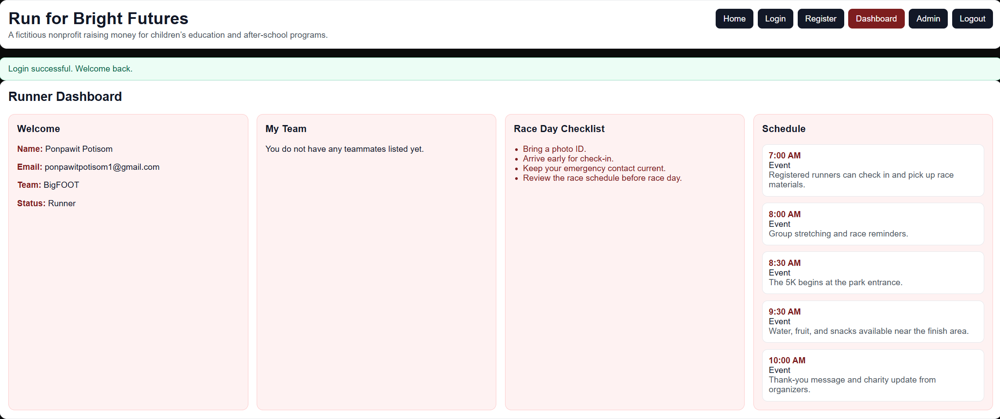
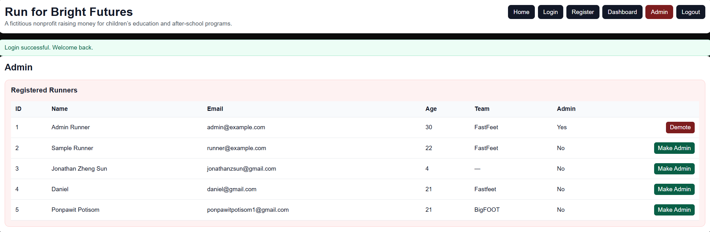
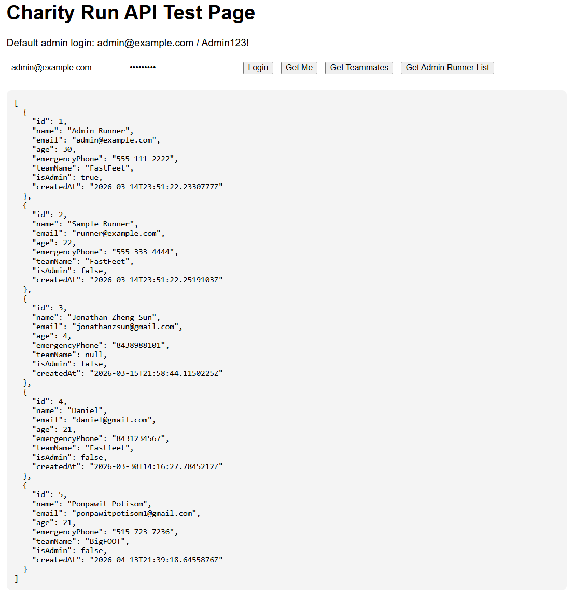

[Back to Portfolio](./)

Project 4 Run for Bright Futures – Charity 5K Website Project
===============

-   **Class: CSCI-334 User Interface Programming** 
-   **Grade: N/A** 
-   **Language(s): JavaScript, React, HTML, CSS, C# (.NET)** 
-   **Source Code Repository: Available upon request**
    (Please [email me](mailto:ppotisom@student.csuniv.edu?subject=GitHub%20Access) to request access.)

## Project description

Run for Bright Futures is a full-stack web application developed for a fictional nonprofit organization hosting a charity 5K run on June 19th. The purpose of the project is to provide a centralized platform where users can learn about the organization’s mission, register for the event, and access important race information.

The system focuses on usability and simplicity, allowing users to create accounts, log in securely, and manage their participation. Each user has access to a personalized dashboard where they can view their registration details, team members, and race-day schedule. The platform also includes an admin panel that allows administrators to view, update, and manage all registered participants efficiently.

The frontend is built using React with Vite, while the backend is developed using ASP.NET Core Minimal API. Runner data is stored in a JSON file, making the application lightweight and suitable for demonstration purposes.

---

## How to run the program

### Frontend

```bash
cd "UI Project/charity-run-react/charity-run-react"
npm install
npm run dev
```

### Backend
```bash
cd "UI Project/charity-run-backend-net10"
dotnet run
```
Once both servers are running, open the frontend URL shown in the terminal

(usually http://localhost:5173)

## UI Design
The application is designed with a clean and simple interface to ensure ease of use for all users.

**Users can:**
- View information about the charity and 5K event
- Register for the race using a form with validation
- Log in securely using email and password
- Access a personal dashboard with race details and team information
- View race schedule and important reminders

**Administrators can:**
- View all registered runners
- Manage user data (update, delete, promote to admin)
- Monitor participation and event organization

**The design follows key UI principles:**
- Simplicity: clean layout with minimal clutter
- Usability: easy navigation and clear actions
- Consistency: uniform design across all pages
- Feedback: error messages and validation for user inputs

  
**Fig 1. Runner dashboard displaying user information, team details, checklist items, and race schedule.**

  
**Fig 2. Admin management page showing registered runners and admin controls.**

  
**Fig 3. Backend API test interface used to verify login and runner data endpoints.**

## 3. Additional Considerations

Sed ut perspiciatis unde omnis iste natus error sit voluptatem accusantium doloremque laudantium, totam rem aperiam, eaque ipsa quae ab illo inventore veritatis et quasi architecto beatae vitae dicta sunt explicabo. 

[Back to Portfolio](./)
